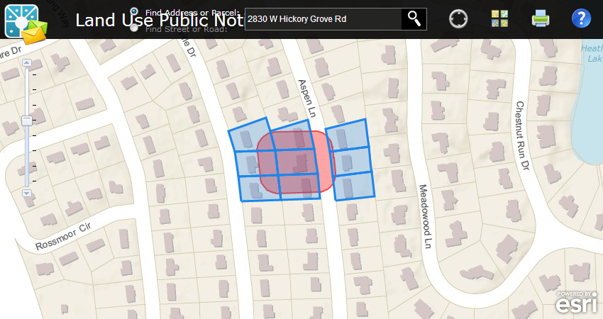

# land-use-public-notification

Land Use Public Notification is a configuration of ArcGIS Server and a JavaScript application that allows local government staff to identify properties within a given distance (buffer) of a subject property and generate mailing labels and/or a structured text file of owners and occupants that fall within the buffer. This application is typically used by local planning and zoning officials, but can be used by any agency looking to notify property owners and occupants of a formal action being taken.

[Try the Land Use Public Notfication application](http://localgovtemplates2.esri.com/PublicNotification/default.htm)

## Features

* Find a specific parcel or road
* Buffer a parcel or road based on a given distance
* Generate mailing labels in PDF or CSV formats
* Print a map of the buffer

## Instructions

### Esri Sample Services

Esri's sample services can be used with this repository to extend the application.

### Your Services

[Detailed help](http://resources.arcgis.com/en/help/localgovernment/10.1/index.html#/What_is_Land_Use_Public_Notification/028s00000014000000/)
on the ArcGIS Resource Center can guide you in the setup and configuration of the app with your services.

### General Help
[New to Github? Get started here.](http://htmlpreview.github.com/?https://github.com/Esri/esri.github.com/blob/master/help/esri-getting-to-know-github.html)

## Requirements

### Esri Sample Services

* Microsoft ASP.NET Framework 4.0 available from the [Microsoft website](http://www.microsoft.com/en-us/download/details.aspx?id=17851)

### Your Services

* ArcGIS for Desktop 10.2 - Standard or Advanced - [About](http://www.esri.com/software/arcgis/arcgis-for-desktop)
* ArcGIS for Server 10.2 - Standard or Advanced - [About](http://www.esri.com/software/arcgis/arcgisserver)
* Local Government Information Model - [About](http://www.arcgis.com/home/item.html?id=ae175b36c4154dda987127dff879350d)
* Microsoft ASP.NET Framework 4.0 available from the [Microsoft website](http://www.microsoft.com/en-us/download/details.aspx?id=17851)

## Resources

Learn more about Esri's [ArcGIS for Local Government maps and apps](http://solutions.arcgis.com/local-government/).

Show me a list of other [Local Government GitHub repositories](http://esri.github.io/#Local-Government).

Additional [information and sample data](http://www.arcgis.com/home/item.html?id=7b4f3974b2c24d339dc0d527366ec1eb)
are available for the application.

This application uses the 3.5 version of
[Esri's ArcGIS API for JavaScript](http://help.arcgis.com/en/webapi/javascript/arcgis/);
see the site for concepts, samples, and a reference for using the API to create mapping web sites.

## Issues

Find a bug or want to request a new feature?  Please let us know by submitting an issue.

## Contributing

Esri welcomes contributions from anyone and everyone.
Please see our [guidelines for contributing](https://github.com/esri/contributing).

## Licensing

Copyright 2013 Esri

Licensed under the Apache License, Version 2.0 (the "License");
you may not use this file except in compliance with the License.
You may obtain a copy of the License at

   http://www.apache.org/licenses/LICENSE-2.0

Unless required by applicable law or agreed to in writing, software
distributed under the License is distributed on an "AS IS" BASIS,
WITHOUT WARRANTIES OR CONDITIONS OF ANY KIND, either express or implied.
See the License for the specific language governing permissions and
limitations under the License.

A copy of the license is available in the repository's
[LICENSE.txt](LICENSE.txt) file.

